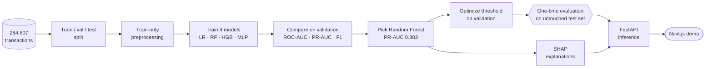

<!-- Template note: same layout as VIRO_README.md. Search for "EDIT:" for the spots that need your repo-specific details. -->

<div align="center">


<a href="https://fraudshield-sable.vercel.app">
  
</a>

<br/>

<a href="https://fraudshield-sable.vercel.app"></a>
<a href="https://fraudshield-sable.vercel.app/research"></a>
<a href="https://github.com/AsjidSiddique/Fraudshield"></a>
<a href="https://asjid-siddique-chi.vercel.app/projects/fraudshield"></a>

<br/>


<br/>


</div>

---

## 🧭 About

**FraudShield** is an end-to-end machine-learning system for **highly imbalanced fraud detection**. Instead of chasing accuracy (meaningless when only ~0.17% of transactions are fraud), it focuses on what matters: **leak-free evaluation, a principled decision threshold, and explanations for every prediction.**

---

## 🏆 Results (untouched final test set)

<div align="center">

| Transactions | Fraud rate | PR-AUC | Precision | Recall | F1 |
|:-:|:-:|:-:|:-:|:-:|:-:|
| **284,807** | **~0.17%** | **0.803** | **86.9%** | **76.8%** | **81.6%** |

</div>

> Selected model: **Random Forest**. Precision / recall / F1 are measured at the threshold optimized on the **validation** set, then applied once to the final test set.

---

## ✨ Highlights

- 🧪 **No data leakage** — preprocessing is fitted on the training split only; the final test set is never touched during tuning
- ⚖️ **Right metrics for imbalance** — ROC-AUC, **PR-AUC**, precision, recall and F1 (not accuracy)
- 🎚️ **Threshold optimization** — the decision threshold is chosen on validation data, not left at an arbitrary 0.5
- 🤖 **Model comparison** — Logistic Regression · Random Forest · HistGradientBoosting · PyTorch MLP
- 🔍 **Explainable** — SHAP shows which features push each transaction toward fraud
- 🌐 **Deployable** — FastAPI inference service with a Next.js front end

---

## 🏗️ Pipeline



---

## 🤖 Models compared

| Model | Family | Why it's in the comparison | Outcome |
|---|---|---|---|
| **Logistic Regression** | Linear | Simple, interpretable baseline | Compared |
| **Random Forest** | Tree ensemble (bagging) | Strong on tabular, imbalanced data | ✅ **Selected** — PR-AUC **0.803** · precision **86.9%** · recall **76.8%** · F1 **81.6%** |
| **HistGradientBoosting** | Gradient-boosted trees | Modern boosted-tree contender | Compared |
| **PyTorch MLP** | Neural network | Tests whether deep learning beats trees on this data | Compared |

**Evaluation metrics:** ROC-AUC · **PR-AUC** · precision · recall · F1 · cost-sensitive evaluation  
**Explainability:** **SHAP** on the selected model  
**Serving:** FastAPI inference service

> Full per-model numbers are on the [research page](https://fraudshield-sable.vercel.app/research). <!-- EDIT: add the other models' PR-AUC values here if you want them in the README -->

---

## 🧰 Tech stack

| Area | Tools |
|---|---|
| Language | Python |
| Classical ML | Scikit-learn (Logistic Regression, Random Forest, HistGradientBoosting) |
| Deep learning | PyTorch (MLP) |
| Data | Pandas · NumPy |
| Explainability | SHAP |
| Serving | FastAPI |
| Front end | Next.js · Vercel |

---

## 🚀 Getting started

```bash
git clone https://github.com/AsjidSiddique/Fraudshield.git
cd Fraudshield
python -m venv .venv && source .venv/bin/activate     # Windows: .venv\Scripts\activate
pip install -r requirements.txt                       # EDIT: your requirements file
```

```bash
# EDIT: replace with your real entry points / notebooks
python scripts/train.py            # train + compare models
python scripts/evaluate.py         # final test-set metrics
uvicorn api.main:app --reload      # FastAPI inference service
```

> 📦 **Data:** place the transactions CSV at `data/` — <!-- EDIT: add dataset name + link/licence -->

---

## 🗂️ Project structure

<!-- EDIT: paste the output of `tree -L 2 -I "node_modules|.venv|__pycache__"` -->

```text
Fraudshield/
├── data/          # dataset (not committed)
├── src/           # preprocessing, models, evaluation, SHAP
├── api/           # FastAPI service
├── web/           # Next.js front end
└── docs/          # figures and results
```

---

## ⚠️ Notes & limitations

- This is a **research / portfolio project**: the dataset and cost assumptions are **illustrative**, not a real banking production system.
- Features in this kind of dataset are anonymized, so SHAP explanations show *which* features matter, not human-readable business reasons.

---

## 🔗 Links

| | |
|---|---|
| **🌐 Live demo** | [fraudshield-sable.vercel.app](https://fraudshield-sable.vercel.app) |
| **💻 Source code** | [github.com/AsjidSiddique/Fraudshield](https://github.com/AsjidSiddique/Fraudshield) |
| **📄 Research page** | [fraudshield-sable.vercel.app/research](https://fraudshield-sable.vercel.app/research) |
| **🗂️ Portfolio case study** | [asjid-siddique-chi.vercel.app/projects/fraudshield](https://asjid-siddique-chi.vercel.app/projects/fraudshield) |
| **🧑‍💻 My portfolio** | [asjid-siddique-chi.vercel.app](https://asjid-siddique-chi.vercel.app) |
| **📑 Resume** | [asjid-siddique-chi.vercel.app/resume](https://asjid-siddique-chi.vercel.app/resume) |
| **💼 LinkedIn** | [linkedin.com/in/asjidsiddique469](https://www.linkedin.com/in/asjidsiddique469/) |
| **🐙 GitHub profile** | [github.com/AsjidSiddique](https://github.com/AsjidSiddique) |

### 🚀 More projects

| Project | What it is | Source | Portfolio |
|---|---|---|---|
| **PCBDefect-X** | Deep-learning PCB defect detection | [GitHub](https://github.com/AsjidSiddique/PCBDefect-X) | [Case study](https://asjid-siddique-chi.vercel.app/projects/pcbdefect-x) |
| **Viro.pk** | Production e-commerce platform | [GitHub](https://github.com/AsjidSiddique/VIRO) | [Case study](https://asjid-siddique-chi.vercel.app/projects/viro) |
| **OS Kernel Simulator** | CPU scheduling & paging simulator | [GitHub](https://github.com/AsjidSiddique/OS-Kernel-Simulator) | [Case study](https://asjid-siddique-chi.vercel.app/projects/os-kernel-simulator) |

---

## 👨‍💻 Author

<div align="center">

**Asjid Siddique** — Software Engineering student @ NUST · Building toward AI/ML research

<a href="https://asjid-siddique-chi.vercel.app"></a>
<a href="https://github.com/AsjidSiddique"></a>
<a href="https://www.linkedin.com/in/asjidsiddique469/"></a>
<a href="mailto:asjadsaddique4@gmail.com"></a>

<br/><br/>

⭐ If you find this useful, a star on the repo means a lot.


</div>
